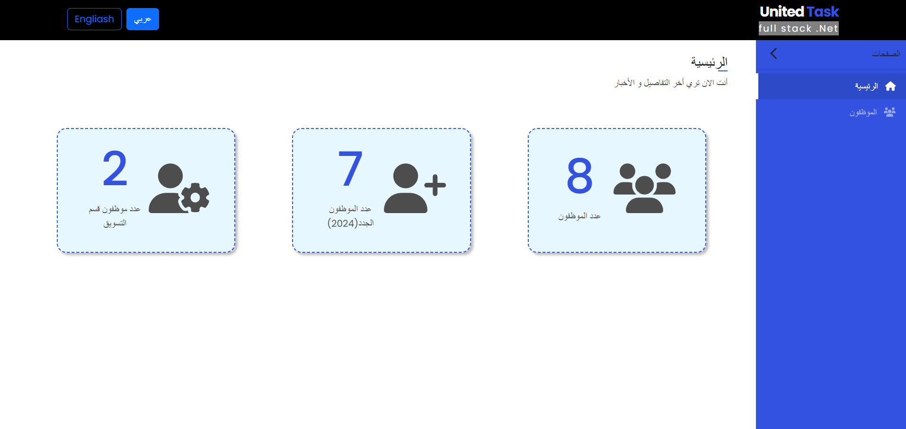
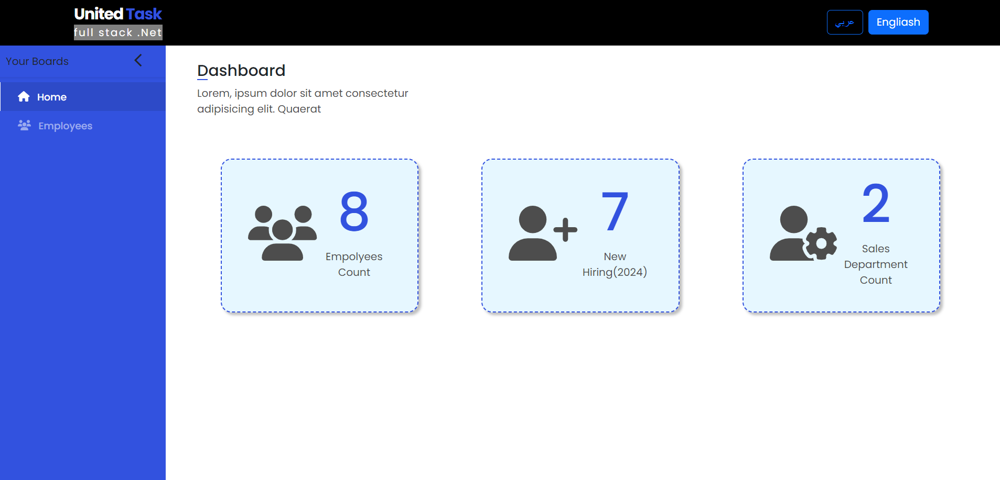

# united-task
- Simple application of 2 pages (Home page and Employyes Page) by Angular as front-end and .Net Rest Apt as back-end.

## What's united task
* [Technologies Used](#technologies-used)
* [Screenshots](#screenshots)
* [Vedio](#vedio)
* [Contact](#contact)

## Technologies Used
- .Net 7 Rest API 
- Microsoft SQL
- Entity frame work 7
- Angular +16 and Angular Material
- ngx translate, ngx toaster, bootstrap and font awsome

## Screenshots
- ngx translate home page

## Vedio
 [@Video Task](https://drive.google.com/file/d/1TdCBm6zv5cpv4APb7Q8VwaBA4GHI9lu3/view?usp=sharing)
## Contact
Created by [@fatma_ashraf](https://www.linkedin.com/in/fatma-ashraf-b57279103) - feel free to contact me!
